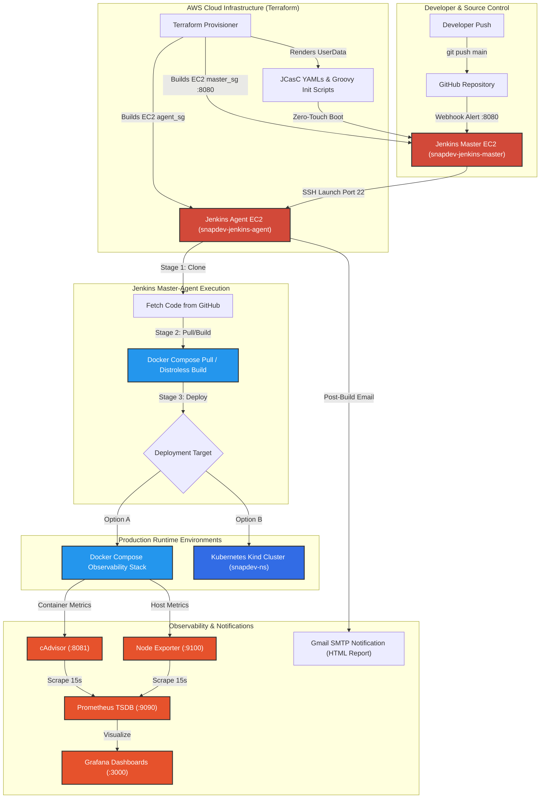

# SnapDev — Production End-to-End DevOps Pipeline & Cloud Platform

[](https://www.python.org/)
[](https://flask.palletsprojects.org/)
[](https://www.docker.com/)
[](https://www.jenkins.io/)
[](https://www.terraform.io/)
[](https://kubernetes.io/)
[](https://prometheus.io/)
[](https://grafana.com/)
[](https://aws.amazon.com/)

---

## Executive Overview

**SnapDev** is an enterprise-grade, end-to-end DevOps platform that containerizes a Python/Flask application and automates its full deployment, orchestration, and monitoring lifecycle on AWS infrastructure.

Key Architectural Capabilities:
- **Infrastructure as Code (IaC)**: Automated provisioning of AWS EC2 instances, Security Groups, and dynamic SSH key pairs using **Terraform**.
- **Zero-Touch Controller Bootstrap**: Fully automated Jenkins setup via **Jenkins Configuration as Code (JCasC)** and **Groovy Post-Initialization Scripts** — zero manual UI setup.
- **Master-Agent Architecture**: Distributed CI/CD pipeline execution separating the controller from execution nodes using SSH.
- **Container Optimization**: Dual Docker builds featuring standard Python builds and optimized **Distroless Multi-Stage Builds**.
- **Observability Stack**: Production monitoring with **Prometheus**, **Grafana**, **cAdvisor**, and **Node Exporter**.
- **Kubernetes Orchestration**: High-availability multi-node cluster deployment via **Kind** with 5-replica pod scaling and NodePort routing.
- **Rich Email Reporting**: Automated HTML email notification reporting for build status.

---

## Master Architecture Diagram



---

## Step-by-Step Deployment & Operations Lifecycle

### Phase 1: Infrastructure Provisioning with Terraform

Navigate to the [`terraform/`](terraform/) directory, configure variables, and run Terraform:

```bash
cd terraform
cp terraform.tfvars.example terraform.tfvars
```

Edit `terraform.tfvars` with your AWS credentials, GitHub token, DockerHub login, and SMTP settings:

```hcl
aws_region             = "us-east-1"
instance_type          = "t3.medium"
master_instance_name   = "snapdev-jenkins-master"
agent_instance_name    = "snapdev-jenkins-agent"

jenkins_admin_username = "admin"
jenkins_admin_password = "YourAdminPassword123!"

github_username        = "Deepak8260"
github_token           = "ghp_xxxxxxxxxxxxxxxxxxxxxxxx"

dockerhub_username     = "kumar3472"
dockerhub_password     = "dckr_pat_xxxxxxxxxxxxxxxxxxxx"

smtp_server            = "smtp.gmail.com"
smtp_port              = 465
smtp_ssl               = true
smtp_username          = "kd.codegeek@gmail.com"
smtp_password          = "xxxx xxxx xxxx xxxx"
admin_email            = "kd.codegeek@gmail.com"
```

Initialize and apply Terraform:

```bash
terraform init
terraform apply -auto-approve
```

---

### What Happens Automatically After `terraform apply`?

Upon running `terraform apply`, Terraform provisions two EC2 instances and executes user data bootstrap scripts (`master.sh.tpl` and `agent.sh.tpl`):

#### 1. EC2 Instance Provisioning
- **`snapdev-jenkins-master` (`aws_instance.master`)**: AWS EC2 `t3.medium` instance running Ubuntu 22.04 LTS, bound to `master_sg` security group.
- **`snapdev-jenkins-agent` (`aws_instance.agent`)**: AWS EC2 `t3.medium` instance running Ubuntu 22.04 LTS, bound to `agent_sg` security group.

#### 2. Master Node Automated Bootstrap (`master.sh.tpl`)
- **Package Installations**: Installs `curl`, `git`, `gnupg`, `openjdk-17-jdk`, `docker.io`, and official `jenkins` LTS package.
- **User Permissions**: Adds user `ubuntu` and `jenkins` to the `docker` group.
- **JCasC Configuration Injections**: Creates `/var/jenkins_home/casc_configs/` and injects:
  - `system.yaml`: Sets `numExecutors: 0`, configures admin email, and configures Gmail SMTP mailer settings.
  - `security.yaml`: Creates local admin user (`jenkins_admin_username`) and applies Global Matrix authorization.
  - `credentials.yaml`: Injects `github-creds`, `dockerhub-creds`, and `smtp-creds`.
  - `nodes.yaml`: Configures permanent SSH build agent node pointing to Agent private IP on port 22 using SSH key `agent-ssh-key`.
- **Groovy Post-Initialization Script Injections**: Creates `/var/jenkins_home/init.groovy.d/` and injects:
  - `create-pipeline-job.groovy`: Automatically registers the `Snap-Dev` pipeline job.
  - `ssh-credential.groovy`: Programmatically provisions the SSH credential `agent-ssh-key` from `/var/lib/jenkins/secrets/agent_key`.
- **Secret & File Injections**: Writes RSA 4096-bit private key to `/var/lib/jenkins/secrets/agent_key` and places `Jenkinsfile-compose` at `/var/lib/jenkins/bootstrap/Jenkinsfile-compose`.
- **Environment & Startup**: Exports `CASC_JENKINS_CONFIG=/var/jenkins_home/casc_configs/` into Jenkins environment and restarts Jenkins service for a complete zero-touch boot.

#### 3. Agent Node Automated Bootstrap (`agent.sh.tpl`)
- **Package Installations**: Installs `curl`, `git`, `openjdk-17-jdk`, and `docker.io`.
- **User Permissions**: Adds user `ubuntu` to `docker` group (`usermod -aG docker ubuntu`).
- **SSH Key Authorization**: Injects the Master controller's dynamic public RSA SSH key into `/home/ubuntu/.ssh/authorized_keys`.
- **Workspace Setup**: Prepares working directory `/home/ubuntu/jenkins`.

---

### Phase 2: Verifying Open Network Ports

Immediately after `terraform apply` finishes, verify that all required security group ports are open and responding on both EC2 instances before proceeding to Jenkins build execution:

| Host / Node | Port | Protocol | Service / Purpose | Verification Command | Expected Output |
| --- | --- | --- | --- | --- | --- |
| **Master Node** | `22` | TCP | SSH Terminal Access | `nc -zv <MASTER_PUBLIC_IP> 22` | `Connection to <MASTER_PUBLIC_IP> 22 port [tcp/ssh] succeeded!` |
| **Master Node** | `8080` | TCP | Jenkins Web UI / Webhooks | `curl -I http://<MASTER_PUBLIC_IP>:8080` | `HTTP/1.1 200 OK` or `302 Found` |
| **Agent Node** | `22` | TCP | SSH Master-to-Agent Link | `nc -zv <AGENT_PUBLIC_IP> 22` | `Connection to <AGENT_PUBLIC_IP> 22 port [tcp/ssh] succeeded!` |
| **Agent Node** | `5000` | TCP | Flask Application | `nc -zv <AGENT_PUBLIC_IP> 5000` | Open port (Post-Deploy) |
| **Agent Node** | `8081` | TCP | cAdvisor Metrics UI | `nc -zv <AGENT_PUBLIC_IP> 8081` | Open port (Post-Deploy) |
| **Agent Node** | `9090` | TCP | Prometheus TSDB UI | `nc -zv <AGENT_PUBLIC_IP> 9090` | Open port (Post-Deploy) |
| **Agent Node** | `9100` | TCP | Node Exporter Host Metrics | `nc -zv <AGENT_PUBLIC_IP> 9100` | Open port (Post-Deploy) |
| **Agent Node** | `3000` | TCP | Grafana Visualization UI | `nc -zv <AGENT_PUBLIC_IP> 3000` | Open port (Post-Deploy) |
| **Agent Node** | `30080` | TCP | Kubernetes NodePort Service | `nc -zv <AGENT_PUBLIC_IP> 30080` | Open port (K8s Deploy) |

---

### Phase 3: Triggering Pipeline Job in Jenkins UI

1. Open your web browser and navigate to `http://<MASTER_PUBLIC_IP>:8080`.
2. Log in using the admin credentials defined in `terraform.tfvars` (`jenkins_admin_username` / `jenkins_admin_password`).
3. Notice that **no initial setup wizard appears** — JCasC and Groovy scripts have pre-configured Jenkins.
4. Verify Agent Node connection: Go to **Manage Jenkins → Nodes**. The node `flask-app-agent` will show as **In-Service / Connected**.
5. Click on the pre-created pipeline job **`Snap-Dev`** on the main dashboard.
6. Click **Build Now** in the left sidebar to execute the pipeline.

```text
Build Execution Flow:
[Stage 1: Clone Repository] ---> [Stage 2: Pull Latest Image] ---> [Stage 3: Deploy Application] ---> [Post Stage: Send HTML Email]
```

---

### Phase 4: Post-Build Service & Email Verification

After the Jenkins build finishes with status **SUCCESS** (Green indicator), verify each deployed application service and notification:

#### 1. Verify Flask Web Application
Access the deployed Flask application in your browser:
- **Homepage**: `http://<AGENT_PUBLIC_IP>:5000`
- **Topic Pages**:
  - `http://<AGENT_PUBLIC_IP>:5000/docker`
  - `http://<AGENT_PUBLIC_IP>:5000/flask`
  - `http://<AGENT_PUBLIC_IP>:5000/git`
  - `http://<AGENT_PUBLIC_IP>:5000/linux`
  - `http://<AGENT_PUBLIC_IP>:5000/python`

Verify all pages render the styled CSS interface without errors.

---

#### 2. Verify cAdvisor Container Metrics UI
Access cAdvisor to monitor live Docker container resource consumption:
- URL: `http://<AGENT_PUBLIC_IP>:8081`
- Check sub-path `/docker` to observe CPU, Memory, Network, and Filesystem utilization streams for container `snapdev-app`.

---

#### 3. Verify Prometheus TSDB Metrics Engine
Access the Prometheus Web Console:
- URL: `http://<AGENT_PUBLIC_IP>:9090`
- Navigate to **Status → Targets**.
- Confirm all 3 scrape targets show status **`UP (1/1)`**:
  - `prometheus` (`localhost:9090`)
  - `cAdvisor-docker` (`cadvisor:8080`)
  - `NodeExporter` (`node-exporter:9100`)
- Test a sample PromQL expression query: `container_cpu_usage_seconds_total` or `node_memory_MemAvailable_bytes`.

---

#### 4. Verify Node Exporter Host System Metrics
Access the raw OS metrics endpoint:
- URL: `http://<AGENT_PUBLIC_IP>:9100/metrics`
- Confirm raw Prometheus formatted metrics (CPU utilization, load averages, memory bounds) are emitted.

---

#### 5. Verify Grafana Visualization Dashboards
Access the Grafana UI:
- URL: `http://<AGENT_PUBLIC_IP>:3000`
- Default Login: Username `admin` / Password `admin` (Set new password when prompted).
- Confirm Data Source: Navigate to **Configuration → Data Sources**, select Prometheus (`http://prometheus:9090`), and click **Save & Test**.
- Confirm Dashboards: Import dashboard ID `1860` (Node Exporter Full) and `14282` (cAdvisor Monitoring) to view visual graphs.

---

#### 6. Verify Email Notification Report
Open the inbox of the email address specified in `admin_email` (e.g., Gmail):
- Confirm an email subject titled: `✅ Snap Dev CI/CD | Build Success #1`.
- Verify the responsive HTML body contains:
  - Header status banner: **`✅ BUILD SUCCESSFUL`** in green background (`#16a34a`).
  - Summary table listing Project (`Snap Dev`), Job Name (`Snap-Dev`), Build Number (`#1`), and Status (`SUCCESS`).
  - Direct action button **"View Build Details"** linking to `http://<MASTER_PUBLIC_IP>:8080/job/Snap-Dev/1/`.

---

### Phase 5: Kubernetes (Kind) Cluster Deployment

To test production Kubernetes pod scaling and service routing on the Agent instance:

1. SSH into the Agent instance:
   ```bash
   ssh -i terraform/terraform-key.pem ubuntu@<AGENT_PUBLIC_IP>
   cd /home/ubuntu/jenkins/workspace/Snap-Dev
   ```

2. Provision 3-Node Kind Cluster:
   ```bash
   kind create cluster --config k8s/config.yml --name snapdev-cluster
   ```

3. Deploy Kubernetes Resources:
   ```bash
   kubectl apply -f k8s/namespace.yml
   kubectl apply -f k8s/deployment.yml
   kubectl apply -f k8s/service.yml
   ```

4. Verify Kubernetes Pods & Service:
   ```bash
   # Verify 5 replicas running across 2 worker nodes
   kubectl get pods -n snapdev-ns -o wide

   # Verify NodePort service binding 5000 -> 30080
   kubectl get svc -n snapdev-ns
   ```

5. Access Application via Kubernetes NodePort:
   - URL: `http://<AGENT_PUBLIC_IP>:30080`

---

## Global Verification & Troubleshooting Matrix

| Problem / Symptom | Root Cause | Resolution Strategy |
| --- | --- | --- |
| **Jenkins UI not loading on port 8080** | Security group rule missing or UserData script running. | Check `master_sg` allows port 8080. Check boot status: `ssh ubuntu@<MASTER_IP> "tail -f /var/log/user-data.log"`. |
| **Agent Offline in Jenkins UI** | Incorrect private IP in `jcasc/nodes.yaml` or missing SSH key. | Verify agent private IP match. Check `/var/lib/jenkins/secrets/agent_key` file permissions (`0600`). |
| **GitHub Webhook Fails (403/500)** | Payload URL missing trailing slash `/github-webhook/`. | Update Payload URL in GitHub Settings to `http://<MASTER_IP>:8080/github-webhook/`. |
| **Email Notification Fails** | Incorrect SMTP port/credentials or Gmail app password missing. | Use 16-character Gmail App Password instead of account password. Ensure `smtp_port = 465` and `smtp_ssl = true`. |
| **Prometheus Target Shows DOWN** | Containers not on same Docker network. | Ensure all observability containers run on `snapnet` network (`docker network inspect snapnet`). |
| **Kubernetes Pods Pending** | CPU/Memory limits exceeded on worker nodes. | Run `kubectl describe pod <POD_NAME> -n snapdev-ns` to view scheduler events. |

---

## Maintainer & License

- **Project Lead / Author**: Deepak Kumar (`Deepak8260` / `kumar3472`)
- **Repository**: [Deepak8260/Snap_Dev](https://github.com/Deepak8260/Snap_Dev)
- **License**: Open Source under the MIT License.
